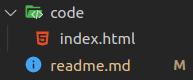
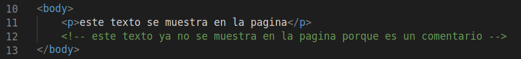
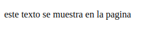

# HTML5

## Herramientas necesarias
* navegador
* editor de codigo

---

## Que es html?
Es un lenguaje de marcas(etiquetas) de hypertextos, que se utiliza para crear la estructura del contenido de un sitio web.

---

## Creando un archivo html
* Los archivos que contienen codigo html deben ser nombrados con la extencion *.html* de este modo le indicamos al navegador que el archivo contiene codigo html.

* La pagina principal de un sitio web debe ser nombrado *index*, ya que es un estandar que la pagina principal del sitio se guarde en ese documento, asi el navegador sabe que mostrar cuando se ingresa por primera vez a nuestro sitio.



---

## Etiquetas y atributos
* las **etiquetas** son la forma en que se escribe html y le indican al navegador como esperamos que se represente el contenido de nuestra pagina.
  * hay etiquetas que tienen apertura y cierre `<p> texto </p>`
  * o solo apertura ya que se auto cierran `<br>`
* y los **atributos** son informacion adicional que utiliza el navegador y que este se agrega en la etiqueta de apertura.
  * `<a href="url"> texto </a>`
  * ``

--

## Estructura basica de un documento html
* En html cualquier pagina nueva que querramos crear debera contar siempre con un codigo base, y ese codigo bases es...


---

## Comentarios
* podemos comentar codigo o simplemente dejar notas, estos comentarios seran ignorados por el navegador y no se mostraran en la pagina web.

* para dejar un comentario se utilizaz `<!--comentario-->`

<!-- 

 -->

|  |  |
| ----------------------------------- | ------------------------------------------------- |

---

### Etiquetas de la estructura basica
1. #### **html**
* la etiqueta *html* es la etiqueta raiz del documento, esta etiqueta contiene todo el codigo html dentro de ella, tambien existe un atributo llamado `lang=""` para la etiqueta html, este atributo indica el idioma en el que esta escrito el contenido de la pagina web.

    ```html
    <html lang="es"> </html>
    ```
     "*es*" indica que el contenido esta escrito en espanol 

2. #### **!DOCTYPE**
* La etiqueta *!doctype* le indica al navegador la version de html que se esta usando, dependiendo de la version algunas etiquetas seran o no soportadas, la ultima version es html5 y se representa asi...
    ```html
    <!DOCTYPE html>
    ````

3. #### **meta**
* La etiqueta *meta* es usada por el navegador con ella le podedmos agregar diferentes metadatos como...
  * charset, habilita caracteres especiales para los idiomas.
  * viewport, ayuda a que la pagina web se adapte a los dispositivos.
  * description, podemos agregar una descripcion que mostraran los navegadores (que no rebase los 165 caracteres), es muy importante a nivel de SEO.
  * etc.
    ```html
    <meta charset="UTF-8">
    <meta name=viewport" content="width=device-width, initial-scale=1.0">
    <meta name="description" content="aqui encontraras muchos gatitos"> <!--cada pagina debe tener su descripcion-->
    ```
  
1. #### **title**
* El texto que se coloque dentro de ella sera el que se mostrara en la pestana del navegador y en los resultados de busquedas, el texto no debe rebasar entre 55 y 65 caracteres.
    ```html
    <title>Gatitos Gratis</title>
    ```


me quede en 1:24:00